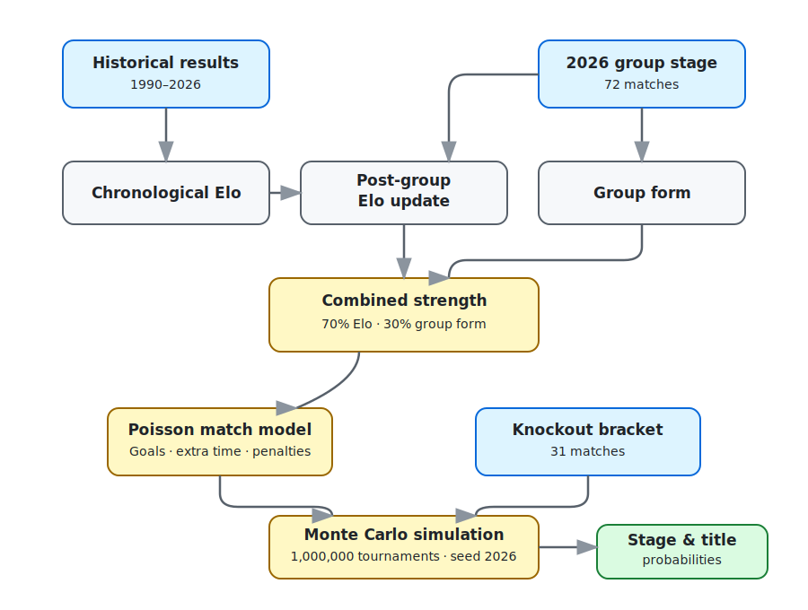
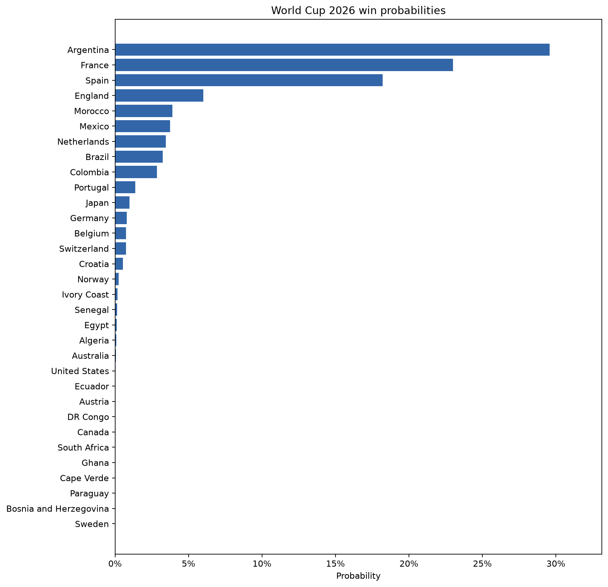
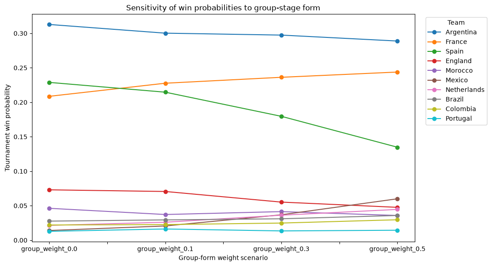

# World Cup 2026 Monte Carlo Simulations

Python project that estimates every team's probability of reaching each stage
of the 2026 FIFA World Cup knockout phase. Team strength combines chronological
Elo ratings with recent group-stage form; a Poisson model then simulates the
official knockout bracket one million times.

> The probabilities are model estimates, not forecasts from FIFA or betting
> odds. They depend on the included data and the modelling assumptions described
> below.

## Quick start

Python 3.10 or newer is recommended.

```bash
git clone git@github.com:michelangelostefanini/worldcup2026-montecarlo-simulations.git
cd worldcup2026-montecarlo-simulations

python3 -m venv .venv
source .venv/bin/activate
python -m pip install -r requirements.txt
jupyter notebook notebooks/worldcup_simulation.ipynb
```

Run the notebook from top to bottom. Its first cell contains all the main
parameters, including the simulation count, random seed, Elo settings, model
weights and Poisson parameters. Results are written to `outputs/`.

## Model structure



### 1. Chronological Elo

All completed international matches in the configured date range are processed
in chronological order:

```text
expected_home = 1 / (1 + 10 ^ ((away_elo - home_elo - advantage) / 400))
new_elo       = old_elo + K * (actual_result - expected_result)
```

Each team starts at `1500` Elo. A `100`-point home advantage is applied only to
non-neutral matches. Matches before `2018-01-01` are a calibration period and
use 20% of the normal K-factor; later matches use the full values.

| Competition | K |
|---|---:|
| Friendly | 10 |
| UEFA Nations League | 20 |
| FIFA World Cup qualification | 25 |
| UEFA Euro qualification | 25 |
| Copa América | 35 |
| UEFA Euro | 35 |
| Historical FIFA World Cup | 50 |
| 2026 World Cup group stage | 60 |
| Other competitions | 20 |

The 2026 group-stage results update the historical Elo ratings before the
knockout simulations. Elo is then frozen throughout each simulated tournament
(`static_elo=True`).

### 2. Group-stage form

Recent form is calculated from the 2026 group-stage results:

```text
form = points_per_game
     + 0.20 * goal_difference_per_game
     + 0.10 * goals_for_per_game
     + 0.10 * xg_difference_per_game  # only if xG columns are available
```

Post-group Elo and group form are independently min-max normalized and combined:

```text
final_strength = 0.70 * normalized_elo + 0.30 * normalized_group_form
```

The notebook also tests group-form weights of `0.0`, `0.1`, `0.3` and `0.5`.

### 3. Poisson match simulation

For two teams A and B, regulation-time expected goals are:

```text
lambda_a = 1.35 * (strength_a / strength_b) ^ 1.0
lambda_b = 1.35 * (strength_b / strength_a) ^ 1.0
```

Both goal counts are sampled independently from Poisson distributions and
clipped to expected-goal values between `0.10` and `5.00`. A draw triggers extra
time with one-third of the regulation lambdas. If the score is still level, the
penalty shootout is sampled using:

```text
P(A wins on penalties) = strength_a / (strength_a + strength_b)
```

Every knockout match is neutral. Winners advance according to
`next_match_id` and `next_slot` in the bracket CSV, avoiding hard-coded paths.

The detailed simulation also records every match ID. For matches after the
Round of 32 it reports both the probability that a particular matchup occurs
and each team's win probability conditional on that matchup. This distinction
avoids treating a strong but very unlikely finalist as the "favorite" of a
final that it rarely reaches.

## Datasets

All inputs are stored in `data/`. Team names must be consistent across files.

| File | Contents | Rows used |
|---|---|---:|
| `historical_results.csv` | International results with date, teams, score, competition and neutral-ground flag. The notebook uses `1990-01-01`–`2026-06-10`; older rows remain available for other experiments. | 32,287 |
| `group_stage_2026.csv` | All 72 completed group-stage matches for the 48 teams, dated `2026-06-11`–`2026-06-27`. Optional `home_xg` and `away_xg` columns are supported. | 72 |
| `bracket_2026.csv` | The 16 Round-of-32 pairings plus the routing of winners through R16, quarterfinals, semifinals and final. | 31 |

The historical file includes extra `city` and `country` fields, which the model
does not use. Its required schema is:

```csv
date,home_team,away_team,home_score,away_score,tournament,neutral
```

The bracket schema is:

```csv
match_id,round,team_a,team_b,next_match_id,next_slot
```

The data files are included to reproduce this analysis. Their original source
and licensing are not documented in this repository; verify reuse rights before
redistributing them independently.

## Main implementation choices

| Choice | Value |
|---|---|
| Historical window | `1990-01-01` to `2026-06-10` |
| Full-weight Elo from | `2018-01-01` |
| Warm-up K multiplier | `0.20` |
| Initial Elo / scale | `1500 / 400` |
| Home advantage | `100` Elo points |
| Strength weights | `70% Elo / 30% group form` |
| Equal-team expected goals | `1.35` per team |
| Extra-time lambda multiplier | `1/3` |
| Knockout Elo | Static after the group stage |
| Monte Carlo runs | `1,000,000` |
| Random seed | `2026` |

These are explicit assumptions rather than parameters fitted automatically on a
held-out validation set.

## Results

With the default configuration, Argentina has the highest estimated title
probability (`29.58%`), followed by France (`23.00%`) and Spain (`18.21%`).
Together, the top three account for about 70.8% of simulated champions.

| Team | Reach R16 | Reach QF | Reach SF | Reach final | Champion |
|---|---:|---:|---:|---:|---:|
| Argentina | 99.39% | 89.13% | 69.72% | 50.04% | **29.58%** |
| France | 98.32% | 80.88% | 57.11% | 37.80% | **23.00%** |
| Spain | 93.01% | 69.38% | 59.61% | 32.35% | **18.21%** |
| England | 91.43% | 53.87% | 33.60% | 14.20% | **6.00%** |
| Morocco | 51.08% | 47.68% | 18.22% | 9.01% | **3.89%** |
| Mexico | 81.62% | 41.15% | 24.44% | 9.62% | **3.76%** |
| Netherlands | 48.92% | 45.45% | 16.96% | 8.23% | **3.46%** |
| Brazil | 59.63% | 42.52% | 21.22% | 8.33% | **3.24%** |
| Colombia | 95.88% | 59.63% | 17.99% | 8.39% | **2.85%** |
| Portugal | 57.05% | 17.98% | 12.46% | 4.03% | **1.39%** |





Complete outputs:

- [`outputs/stage_probabilities.csv`](outputs/stage_probabilities.csv)
- [`outputs/winner_probabilities.csv`](outputs/winner_probabilities.csv)
- [`outputs/most_likely_matchups.csv`](outputs/most_likely_matchups.csv)
- [`outputs/plots/stage_probability_heatmap.png`](outputs/plots/stage_probability_heatmap.png)
- [`outputs/plots/final_probabilities.png`](outputs/plots/final_probabilities.png)
- [`outputs/plots/group_stage_weight_sensitivity.png`](outputs/plots/group_stage_weight_sensitivity.png)

## Repository structure

```text
.
├── data/
│   ├── historical_results.csv
│   ├── group_stage_2026.csv
│   └── bracket_2026.csv
├── notebooks/
│   └── worldcup_simulation.ipynb
├── src/
│   ├── data_loading.py
│   ├── ratings.py
│   ├── match_model.py
│   ├── tournament.py
│   └── analysis.py
├── outputs/
│   ├── stage_probabilities.csv
│   ├── winner_probabilities.csv
│   └── plots/
├── requirements.txt
└── README.md
```

## Future improvements

- Implementation of adaptive Elo changes during simulations.
- Better predictive model than indipendent Poisson scores.
- Include more data like: injuries, suspensions, lineups, travel, hydration breaks,rest and specialist penalty ability.
- Automatically calibrate Elo and Poisson parameters.

## Contacts
Michelangelo Stefanini: michelangelo.stefanini@mail.polimi.it

## License

The source code is released under the [MIT License](LICENSE). The datasets are
not covered by that grant; their original terms should be checked separately.
